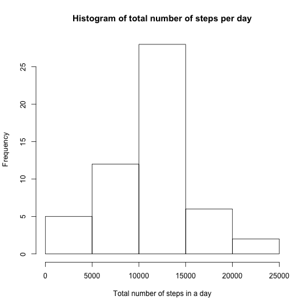
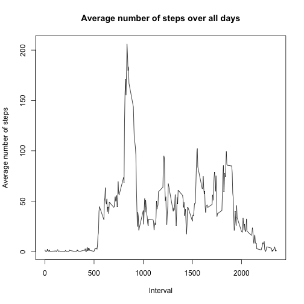
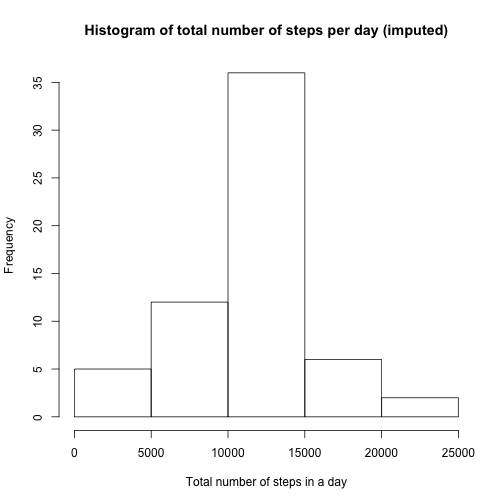
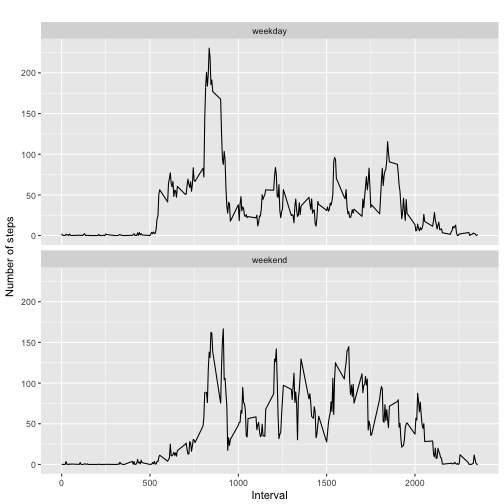

```r
# Loading the necessary packages
library(knitr)
library(dplyr)
library(ggplot2)
```


```r
opts_chunk$set(echo = TRUE)
```

## Loading and preprocessing the data


```r
# loading the data

repdata1 <- read.csv('activity.csv')
head(repdata1)
```

```
##   steps       date interval
## 1    NA 2012-10-01        0
## 2    NA 2012-10-01        5
## 3    NA 2012-10-01       10
## 4    NA 2012-10-01       15
## 5    NA 2012-10-01       20
## 6    NA 2012-10-01       25
```

```r
str(repdata1)
```

```
## 'data.frame':	17568 obs. of  3 variables:
##  $ steps   : int  NA NA NA NA NA NA NA NA NA NA ...
##  $ date    : Factor w/ 61 levels "2012-10-01","2012-10-02",..: 1 1 1 1 1 1 1 1 1 1 ...
##  $ interval: int  0 5 10 15 20 25 30 35 40 45 ...
```

```r
#removing the missing values for steps

repdata <- repdata1[!is.na(repdata1$steps),]
head(repdata)
```

```
##     steps       date interval
## 289     0 2012-10-02        0
## 290     0 2012-10-02        5
## 291     0 2012-10-02       10
## 292     0 2012-10-02       15
## 293     0 2012-10-02       20
## 294     0 2012-10-02       25
```

```r
str(repdata)
```

```
## 'data.frame':	15264 obs. of  3 variables:
##  $ steps   : int  0 0 0 0 0 0 0 0 0 0 ...
##  $ date    : Factor w/ 61 levels "2012-10-01","2012-10-02",..: 2 2 2 2 2 2 2 2 2 2 ...
##  $ interval: int  0 5 10 15 20 25 30 35 40 45 ...
```

## What is mean total number of steps taken per day?


```r
# grouping the data by the date variable
date_wise <- group_by(repdata, date)

#calculating the total number of steps per day
steps_by_day <- summarise(date_wise, total = sum(steps))
steps_by_day
```

```
## # A tibble: 53 x 2
##    date       total
##    <fct>      <int>
##  1 2012-10-02   126
##  2 2012-10-03 11352
##  3 2012-10-04 12116
##  4 2012-10-05 13294
##  5 2012-10-06 15420
##  6 2012-10-07 11015
##  7 2012-10-09 12811
##  8 2012-10-10  9900
##  9 2012-10-11 10304
## 10 2012-10-12 17382
## # ... with 43 more rows
```

```r
#Plotting a histogram of the total number of steps taken each day
hist(steps_by_day$total, main="Histogram of total number of steps per day", 
     xlab="Total number of steps in a day")
```



```r
#Calculating the mean and median of the steps per day
summary(steps_by_day)   
```

```
##          date        total      
##  2012-10-02: 1   Min.   :   41  
##  2012-10-03: 1   1st Qu.: 8841  
##  2012-10-04: 1   Median :10765  
##  2012-10-05: 1   Mean   :10766  
##  2012-10-06: 1   3rd Qu.:13294  
##  2012-10-07: 1   Max.   :21194  
##  (Other)   :47
```
Mean & Median of total number of steps per day are 10766 and 10765 respectively.


## What is the average daily activity pattern?


```r
# aggregating the data by interval
steps_by_interval <- aggregate(steps ~ interval, repdata, mean)

# create a time series plot 
plot(steps_by_interval$interval, steps_by_interval$steps, type='l', 
     main="Average number of steps over all days", xlab="Interval", 
     ylab="Average number of steps")
```



```r
# find row with max of steps
max_steps_row <- which.max(steps_by_interval$steps)

# find interval with this max
steps_by_interval[max_steps_row, ]
```

```
##     interval    steps
## 104      835 206.1698
```
The interval 835 has the maximum average number of steps which is 206.1698


## Imputing missing values


```r
# Using the mean for that 5-minute interval where the value is missing for imputing the variable

data_imputed <- repdata1
for (i in 1:nrow(data_imputed)) {
  if (is.na(data_imputed$steps[i])) {
    interval_value <- data_imputed$interval[i]
    steps_value <- steps_by_interval[
      steps_by_interval$interval == interval_value,]
    data_imputed$steps[i] <- steps_value$steps
  }
}
```
The new data set repdata_impute which equals to repdata but without NA’s. All NA’s are replaced with the mean for that 5-minute interval where the value is missing.


# calculate  total number of steps taken each day and plotting the histogram again


```r
df_imputed_steps_by_day <- aggregate(steps ~ date, data_imputed, sum)
head(df_imputed_steps_by_day)
```

```
##         date    steps
## 1 2012-10-01 10766.19
## 2 2012-10-02   126.00
## 3 2012-10-03 11352.00
## 4 2012-10-04 12116.00
## 5 2012-10-05 13294.00
## 6 2012-10-06 15420.00
```

```r
hist(df_imputed_steps_by_day$steps, main="Histogram of total number of steps per day (imputed)", 
     xlab="Total number of steps in a day")
```



```r
# get mean and median of imputed data
mean(df_imputed_steps_by_day$steps)
```

```
## [1] 10766.19
```

```r
median(df_imputed_steps_by_day$steps)
```

```
## [1] 10766.19
```

```r
# get mean and median of data without NA's
mean(steps_by_day$total)
```

```
## [1] 10766.19
```

```r
median(steps_by_day$total)
```

```
## [1] 10765
```

Mean values stays the same but therer is slight difference in meadian value.


# Are there differences in activity patterns between weekdays and weekends?


```r
data_imputed['type_of_day'] <- weekdays(as.Date(data_imputed$date))
data_imputed$type_of_day[data_imputed$type_of_day  %in% c('Saturday','Sunday') ] <- "weekend"
data_imputed$type_of_day[data_imputed$type_of_day != "weekend"] <- "weekday"

# convert type_of_day from character to factor
data_imputed$type_of_day <- as.factor(data_imputed$type_of_day)

# calculate average steps by interval across all days
df_imputed_steps_by_interval <- aggregate(steps ~ interval + type_of_day, data_imputed, mean)

# creat a plot
qplot(interval, 
      steps, 
      data = df_imputed_steps_by_interval, 
      type = 'l', 
      geom=c("line"),
      xlab = "Interval", 
      ylab = "Number of steps", 
      main = "") +
  facet_wrap(~ type_of_day, ncol = 1)
```

```
## Warning: Ignoring unknown parameters: type
```



